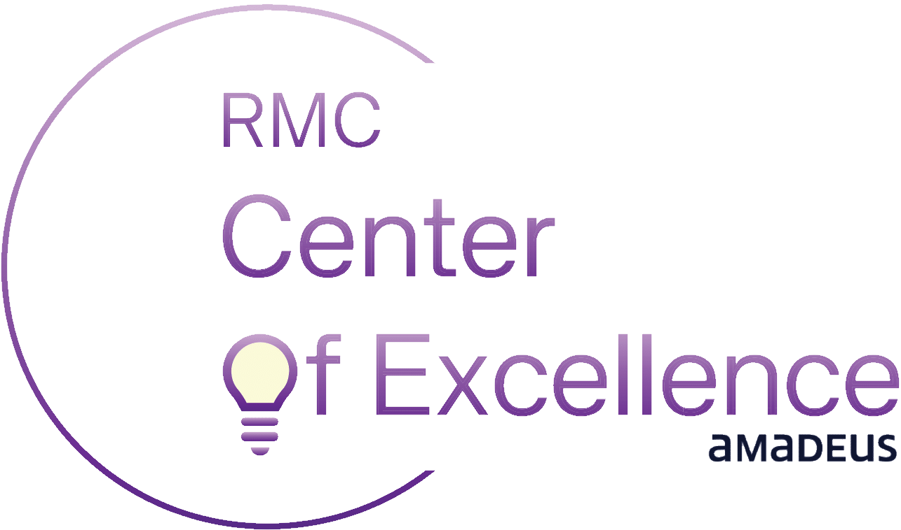

  
   
  

  <h1>CoE Academy: Power Automate</h1>
  
<strong>Interactive Learning Platform for Microsoft Power Automate</strong>

  

    
    
    
    
  

---

## Introduction

The **CoE Academy: Power Automate** is an interactive web-based training platform designed to improve the experience of learning of Amadeus employees with practical knowledge and hands-on experience in Microsoft Power Automate. This modern environment combines elegant presentations with real-world examples to accelerate automation adoption across the organization.

## Purpose

This platform serves multiple strategic objectives within the Amadeus ecosystem:

1. **Knowledge Transfer** - Standardize Power Automate training across the teams.
2. **Adoption Acceleration** - Lower the barrier to entry for automation technologies
3. **Best Practices** - Establish and promote automation standards and governance
4. **Community Building** - Foster a culture of collaboration and innovation
5. **Efficiency Gains** - Enable teams to automate repetitive tasks and optimize workflows

## Features

### Session 1: Power Automate Introduction
- Introduction to automation and its business value
- Power Automate interface and core concepts
- Creating your first flow with step-by-step guidance
- Hands-on flow builder demonstration

### Session 2: Workshop
- Flow design patterns
- Conditional logic and branching
- Error handling and testing strategies
- AI-powered automation with Copilot

### Additional Components
- **Landing Page** - Central hub with session navigation
- **About Section** - Program overview and objectives
- **Wall of Fame** - Showcase of automation champions
- **Feedback System** - QR code-based feedback collection
- **Downloadable Resources** - Sample flows and templates

## Technology Stack

### Frontend Framework
- **React 18.2** - Modern UI library with hooks and context
- **TypeScript 5.4** - Type-safe development experience
- **Vite 5.2** - Lightning-fast build tool and dev server

### Styling & Animation
- **Tailwind CSS 3.4** - Utility-first CSS framework
- **Framer Motion 11** - Smooth animations and transitions
- **Lucide React** - Beautiful icon library

### Additional Libraries
- **React Query** - Server state management
- **Recharts** - Data visualization components

## Deployment

The platform is automatically deployed to GitHub Pages via GitHub Actions workflow:

- **Production URL**: [https://rmc-coe.github.io/coe-academy-mpa/](https://rmc-coe.github.io/coe-academy-mpa/)
- **Session 1**: `/session-1/`
- **Session 2**: `/session-2/`

##  License

This project is proprietary and confidential. For internal use within Amadeus IT Group only.

**© 2025 Amadeus IT Group. All rights reserved.**

## Support

For questions, issues, or feedback:

- **CoE Team**: Contact the Center of Excellence team (rmc.coe@amadeus.com)
- **Technical Issues**: Create an issue in the repository

---

  
<strong>Built with ❤️ by the Center of Excellence</strong>

  
<em>Empowering innovation through automation</em>

